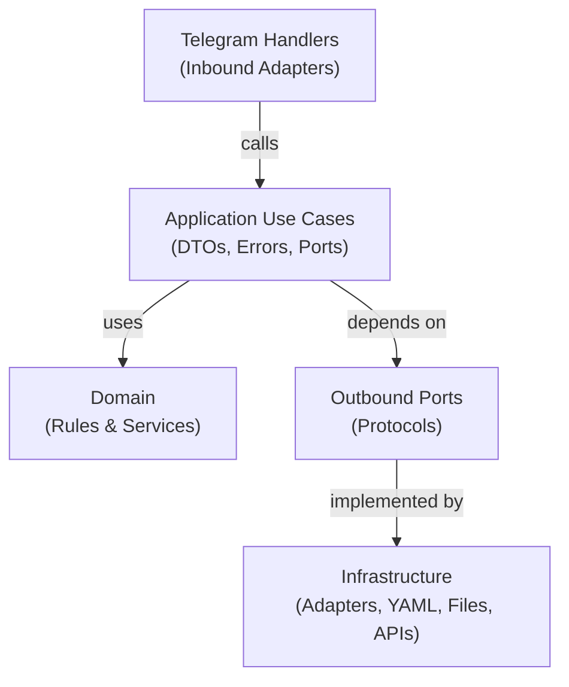

# Stickfix Ports-and-Adapters Architecture

## Purpose

This document explains how Stickfix uses application ports to isolate use cases from Telegram and infrastructure 
concerns. It is intended as an architecture reference for future refactors, especially the ongoing migration from 
Telegram-heavy handlers toward application-level use cases.

It focuses on:
- what ports exist today and why;
- how use cases depend on those ports;
- how infrastructure adapters implement them;
- which dependency boundaries must remain protected;
- when to add a new port;
- how to test adapters and boundaries.

## Architectural Invariants

The following rules protect the application boundary during all refactors:

1. **`bot.application` must not import `telegram` or `telegram.ext`.**
   - This boundary is verified by `tests/application/test_application_seam.py`.
   - It ensures use cases are testable without Telegram objects.

2. **Use cases may only depend on:**
   - Domain services (e.g., `StickerPackService`)
   - Request/result DTOs (e.g., `AddStickerCommand`)
   - Application errors (e.g., `UserNotFoundError`)
   - Outbound ports (e.g., `UserRepository`)

3. **Use cases must not depend on infrastructure adapters directly.**
   - Adapters are wired by handlers; use cases only know about ports.
   - This allows adapters to be swapped without changing application logic.

4. **Infrastructure adapters may import application ports** to declare the contracts they implement.
   - Adapters may depend on external systems (YAML, databases, files, APIs) but only through ports.

5. **Handlers translate Telegram input/output into application DTOs and results.**
   - Handlers instantiate adapters, call use cases with DTOs, and translate results back to Telegram.

6. **Ports expose application concepts, not Telegram, YAML, filesystem, or database details.**
   - Port method names and types should be understandable without knowing the infrastructure.

7. **Runtime wiring may choose concrete adapters, but business decisions stay in use cases or domain services.**

---

## Architecture Overview

### Dependency Direction



>[!TIP] Key insight:
> Dependency flows inward. Use cases declare what they need (ports); handlers and infrastructure providers fulfill 
> that need at runtime.

---

## Existing Ports

## 1. Port Definitions

### UserRepository

Defines a contract for user and public-pack persistence. See [bot/application/ports/user_repository.py](bot/application/ports/user_repository.py).

**Methods:**
- `get_user(user_id: str) -> StickfixUser | None`
- `has_user(user_id: str) -> bool`
- `save_user(user: StickfixUser) -> None`
- `delete_user(user_id: str) -> bool`
- `get_public_pack() -> StickfixUser | None`
- `ensure_public_pack() -> StickfixUser`

### HelpContentProvider

Defines a contract for retrieving raw help text. See [bot/application/ports/help_content.py](bot/application/ports/help_content.py).

**Methods:**
- `get_help_text() -> str`

---

## How Use Cases Depend on Ports

Use cases import ports and receive them as constructor dependencies:

```python
from bot.application.ports import UserRepository

class AddSticker:
    def __init__(self, users: UserRepository) -> None:
        self._users = users

    def __call__(self, command: AddStickerCommand) -> AddStickerResult:
        public_pack = self._users.ensure_public_pack()
        user = self._users.get_user(command.user_id) or public_pack
        # ... apply business logic ...
        self._users.save_user(mutation.effective_pack)
        return AddStickerResult(...)
```

See [bot/application/use_cases/](bot/application/use_cases/) for complete implementations of `SetMode`, `AddSticker`, `GetStickers`, and `DeleteSticker`.

---

## Current Runtime Wiring

In the current implementation, handlers instantiate infrastructure adapters and pass them to use cases:

```python
from bot.infrastructure.persistence import StickfixUserRepository

class StickerHandler(StickfixHandler):
    def __init__(self, dispatcher: Dispatcher, user_db: StickfixDB):
        super().__init__(dispatcher, user_db)
        user_repository = StickfixUserRepository(user_db)  # Adapter instantiation
        self.__add_sticker_use_case = AddSticker(user_repository)  # Inject adapter
```

**Note:** This is current behaviour, not a hard architectural requirement. A future composition root
may centralize this wiring, or handlers may accept use cases as constructor arguments.

See [bot/handlers/](bot/handlers/) for handler implementations.

---

## Testing the Boundary

### Application Seam Test

`tests/application/test_application_seam.py` verifies that `bot.application` does not import
Telegram. It also demonstrates that any adapter conforming to the `UserRepository` protocol
can be used:

```python
# Runtime_checkable Protocol verifies structural conformance
assert_that(isinstance(adapter, ports.UserRepository), is_(True))
```

**Limitation:** `isinstance()` checks only that required methods exist; it does not validate method
semantics. Focused adapter tests provide complete verification.

### How Adapters are Tested

`@runtime_checkable` allows structural type checks, but only in-context tests verify correct behaviour.

For `FileHelpContentProvider` — see [tests/infrastructure/help/test_file_help_content_provider.py](tests/infrastructure/help/test_file_help_content_provider.py):

```python
def test_reads_help_text_from_utf8_file(tmp_path: Path) -> None:
    help_file = tmp_path / "HELP.md"
    help_file.write_text("# Help\n\nUse /add ✨\n", encoding="utf-8")
    provider = FileHelpContentProvider(help_file)
    assert provider.get_help_text() == "# Help\n\nUse /add ✨\n"
```

For `StickfixUserRepository` — see [tests/infrastructure/persistence/test_stickfix_user_repository.py](tests/infrastructure/persistence/test_stickfix_user_repository.py):

Tests verify that the adapter preserves YAML-backed `StickfixDB` semantics while exposing the `UserRepository` contract.

---

## Understanding Protocol-Based Ports

Stickfix uses Python `@runtime_checkable` Protocols instead of abstract base classes. This provides:

- **Structural typing:** Any object implementing the methods conforms to the port; no explicit inheritance.
- **Lightweight:** No metaclass machinery; just a simple interface check.
- **Test-friendly:** Inline adapters can be defined on-the-fly without import boilerplate.

**Caveat:** `isinstance()` checks only that required members exist. It does not verify:
- Method signatures (argument types, return types)
- Preconditions or postconditions (semantics)
- Error behavior

**Consequence:** Focused adapter tests (like the examples above) are essential. They prove correct behaviour
that structural type checks cannot.

---

## When to Add a New Port

Add a new application port when a use case needs information or side effects from outside the application layer.

**Good candidates:**
- Persistence (e.g., `UserRepository`)
- File access (e.g., `HelpContentProvider`)
- External APIs
- Message queues
- Clocks or random sources when deterministic tests matter

**Avoid adding a port when:**
- The behaviour is pure domain logic (belongs in domain services)
- A simple value can be passed through a request DTO
- The dependency belongs entirely inside a handler
- The abstraction has only one method due to speculation rather than an immediate use-case need

**Example justification:** `HelpContentProvider` is justified because the future inline query use case
needs help text without importing Telegram or reading `HELP.md` directly.

---

## Known Transitional Design Choices

### Handler-Level Adapter Instantiation

At this refactor stage, handlers still instantiate some infrastructure adapters directly (e.g.,
`StickfixUserRepository`). This is current behaviour, not a hard architectural requirement.

A future composition root may centralize that wiring, or handlers may accept use cases as constructor
arguments. The important invariant is that use cases never depend directly on adapters—only on ports.

---

## Naming and Placement Conventions

**Ports:**
- Location: `bot/application/ports/`
- Naming: interface names (e.g., `UserRepository`, `HelpContentProvider`)
- Style: `@runtime_checkable` Protocol, one per file

**Adapters:**
- Location: `bot/infrastructure/`
- Naming: domain-specific or `<PortName>Adapter` (e.g., `StickfixUserRepository`, `FileHelpContentProvider`)
- Declaration: `class X(PortName):`

**Use Cases:**
- Location: `bot/application/use_cases/`
- Naming: after the command/query (e.g., `SetMode`, `AddSticker`)
- Pattern: `__call__(request_dto) -> result_dto`

**DTOs:**
- Requests: `bot/application/requests.py`
- Results: `bot/application/results.py`
- Style: dataclasses

**Errors:**
- Location: `bot/application/errors.py`
- Hierarchy: shallow; all inherit from `ApplicationError`
- Naming: application concepts (e.g., `UserNotFoundError`)

---

### Dependency-Injection Boundaries

**Yes.** Ports establish **inversion of control** (IoC) boundaries:

- Use cases declare their external dependencies as **port types** (Protocols), not concrete classes.
- Handlers or composition layers inject concrete **infrastructure adapters** at construction time.
- Use cases remain **Telegram-free** and **testable with in-memory fakes**.

This allows:
- **Testing**: Replace `StickfixUserRepository` with a simple in-memory fake.
- **Swapping implementations**: Switch from YAML to a database without changing use case logic.
- **Isolation**: Use case tests don't touch the filesystem or Telegram APIs.

### Hexagonal Architecture Pattern

This is **Hexagonal/Ports-and-Adapters** architecture:

- **Inbound boundary:** Handlers (Telegram adapters) depend on use cases.
- **Outbound boundary:** Use cases depend on ports, which are implemented by infrastructure adapters.
- **Key rule:** Use cases must not know about Telegram, YAML, or any infrastructure detail.

Evidence: `test_application_seam.py` verifies that importing `bot.application` does not import Telegram.

---

## Example Data Flow

A handler receives a Telegram update, builds a request DTO, calls a use case, and translates the result:

```
Telegram /add command (handler parses)
    ↓ builds DTO
AddStickerCommand
    ↓ passes to use case
AddSticker use case (calls port methods)
    ↓ calls
UserRepository port
    ↓ implemented by
StickfixUserRepository (delegates to storage)
    ↓ calls
StickfixDB (YAML persistence)
    ↓ returns
AddStickerResult DTO
    ↓ translates to
Telegram reply message
```

**Key:** The use case never knows about Telegram, YAML, or how `UserRepository` is implemented.

---

## Summary

### What Ports Do

- **Declare dependencies:** Use cases say "I need a UserRepository," not "I need YAML files."
- **Enable testing:** Swap real adapters for fakes without changing code.
- **Protect boundaries:** The application seam is enforced by tests.

### What Adapters Do

- **Implement contracts:** `StickfixUserRepository` implements `UserRepository`.
- **Delegate to infrastructure:** Adapters know about YAML, databases, files, APIs—but use cases don't.
- **Isolate decisions:** Switching from YAML to a database doesn't require changing use case logic.

### Verification

- `tests/application/test_application_seam.py` — Proves `bot.application` has no Telegram imports.
- Focused adapter tests — Prove correct behaviour (e.g., `FileHelpContentProvider` reads UTF-8 files).
- Use-case tests with fakes — Prove business logic without infrastructure.

### Design Principles from Phase 2

From [phase_2_introduce_an_application_layer_and_explicit_ports.md](traceability-log/phase_2_introduce_an_application_layer_and_explicit_ports.md):

**Goals:**
1. Move business and application decisions out of Telegram handlers
2. Define stable input/output types for use cases
3. Isolate infrastructure behind small ports
4. Preserve all current user-visible behavior
5. Make sticker flows testable with in-memory fakes

**Key Rule:**
> The application layer must not import Telegram types.

**Non-goals (Deliberately Avoided):**
- No change to `Stickfix(token).run()` — runtime entry point unchanged
- No change to command names, wording, or YAML format
- No introduction of new third-party dependencies
- No service locators or frameworks
